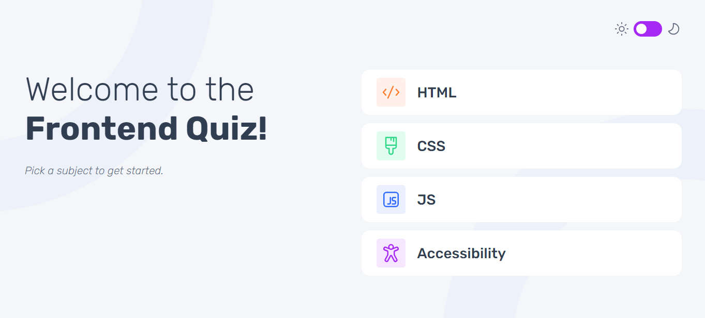
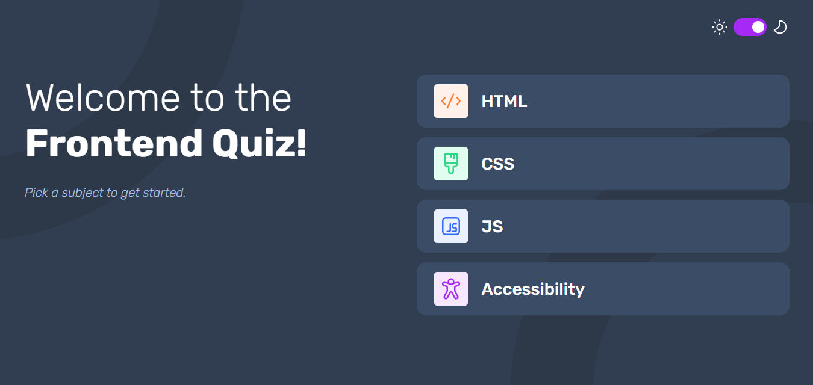
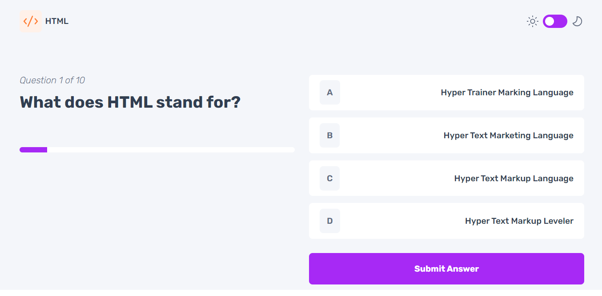
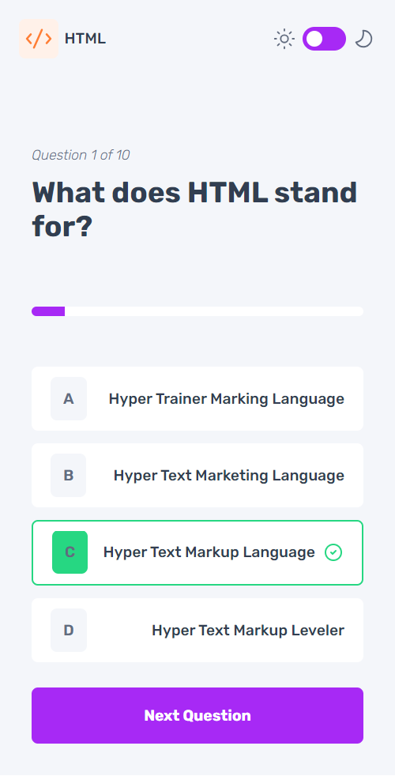
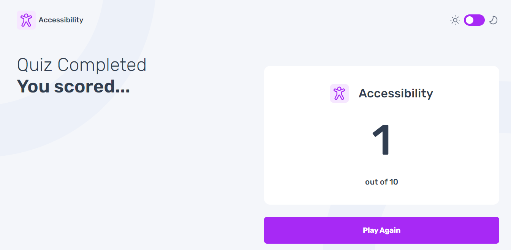

# Frontend Quiz App

## Project Objective

Build out a quiz app based on provided designs using TypeScript and styled-components.

## Features

- Select a quiz subject
- Answer multiple-choice questions
- See correct/incorrect feedback
- View final score
- Responsive design
- Accessible navigation

## Technologies Used

- Vite
- React
- TypeScript
- Styled-components
- React Router

## Screenshots







## Setup and Installation

1. Clone the repository:
   ```bash
   git clone https://github.com/Kendrick-Oppong/quiz-master.git
   cd quiz-master
   ```
2. Install dependencies:
   ```bash
   npm install
   ```
3. Start the development server:
   ```bash
   npm run dev
   ```
4. Build for production:
   ```bash
   npm run build
   ```
5. Preview the production build:
   ```bash
   npm start
   ```

## Contributing

- Use feature branches for development.
- Submit pull requests for review.

## License

This project is licensed under the MIT License.
